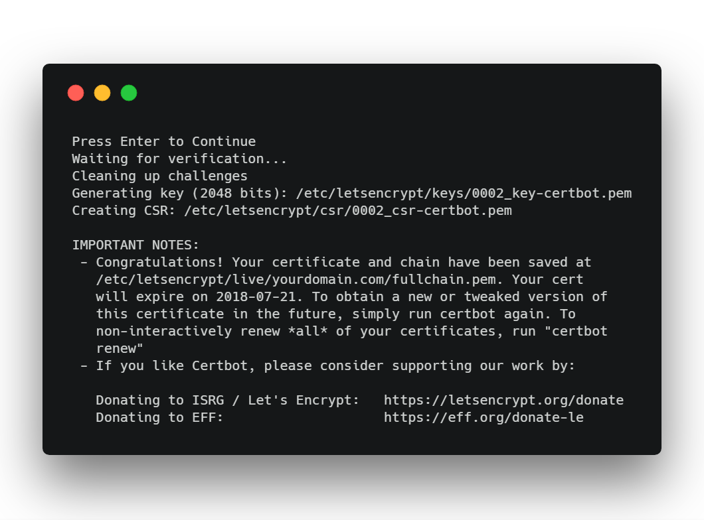

# Intro

This simple tutorial for generating SSL with Express Node.JS and certbot of lets encrypt

## 1. Express

```
  $ npm init --yes

  $ npm i express
```

Create `app.js` file with the following content

```javascript
const express = require("express");

const app = express();

// Allow `dotfiles` static files for challenge purpose
app.use(express.static(__dirname, { dotfiles: "allow" }));

app.listen(80, () => {
  console.log("listening...");
});
```

## Certbot

To install certbot, copy-paste those lines in a terminal :

```
  $ sudo add-apt-repository ppa:certbot/certbot

  $ sudo apt-get update

  $ sudo apt-get install certbot
```

Second, you will generate an SSL certificate with certbot :

```
  certbot certonly --manual
```

- Type your domain name(s) without the protocol part. For instance: yourdomain.com

- It will ask for some approvals and then it will show you a challenge like the following

```bash
  Ps_lIxehLnJapQwCTzCrCu0O562TsDi6yMwZxDa5AzE.FtzH1FPPghXxts9msHWcXDh9JLX7dp5sc9hLGnOoHS4

  And make it available on your web server at this URL:

  http://yourdomain.com/.well-known/acme-challenge/Ps_lIxehLnJapQwCTzCrCu0O562TsDi6yMwZxDa5AzE

```

- Edit the **file name** in .well-known/acme-challenge name to `Ps_lIxehLnJapQwCTzCrCu0O562TsDi6yMwZxDa5AzE` **(the challenge name)**

- Update the renamed file content at .well-known/acme-challenge to `Ps_lIxehLnJapQwCTzCrCu0O562TsDi6yMwZxDa5AzE.FtzH1FPPghXxts9msHWcXDh9JLX7dp5sc9hLGnOoHS4` **(the challenge string)**

- After doing these changed, run this server

```bash
  node app.js
```

After server is started, hit enter in the certbot terminal to complete the challenge



## Reference from [Medium](https://itnext.io/node-express-letsencrypt-generate-a-free-ssl-certificate-and-run-an-https-server-in-5-minutes-a730fbe528ca)
